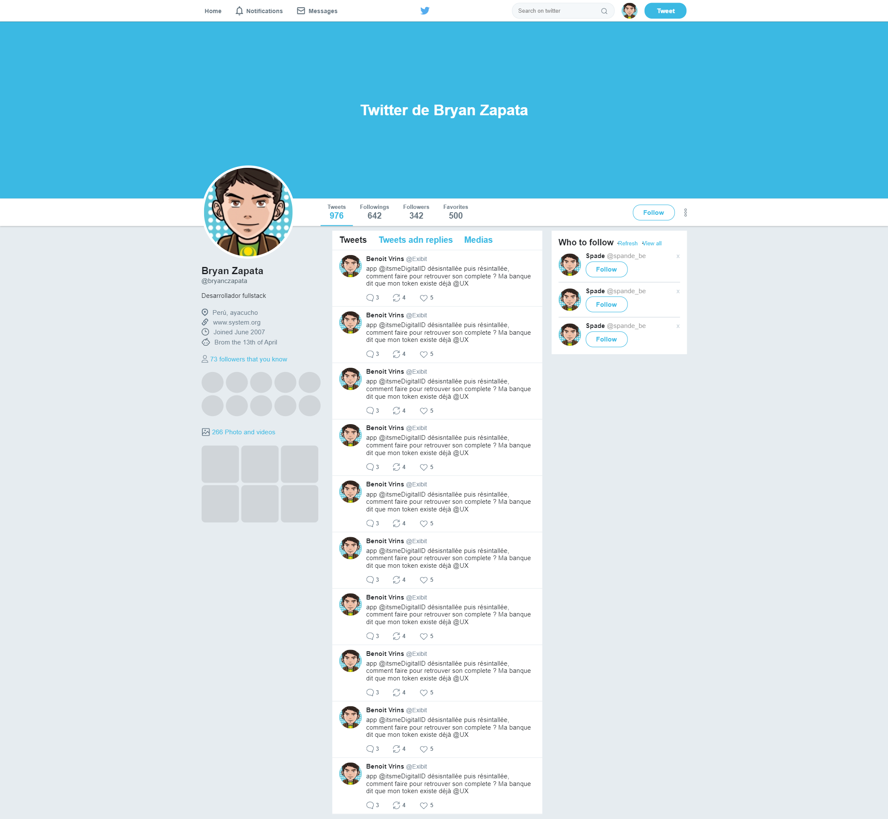

<h1 align="center">
 
Twitter clone
</h1>

A clone of twitter pure css and flexbox

  

  

[//]: # (Add your gifs/images here:)

  

## License

This project is licensed under the MIT License - see the [LICENSE](https://opensource.org/licenses/MIT) page for details.